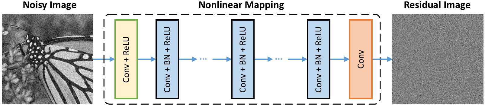
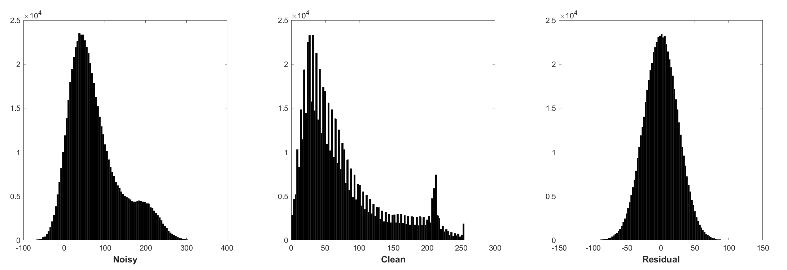
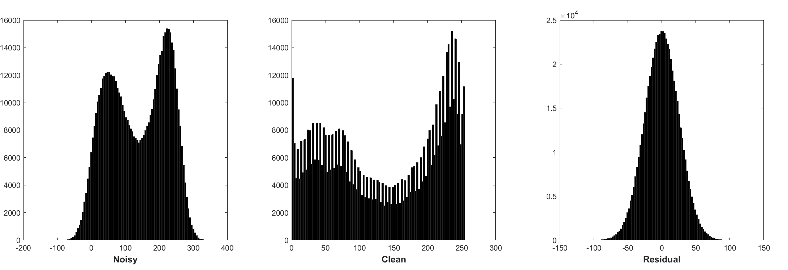
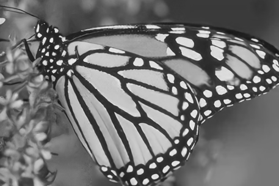
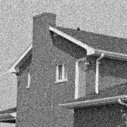
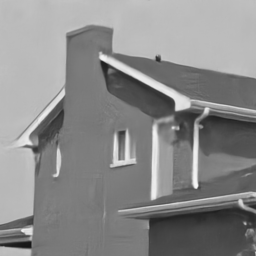
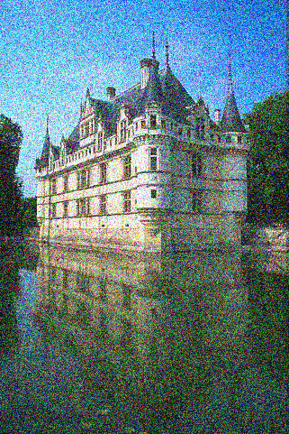
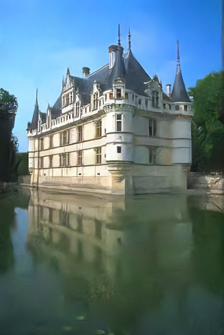
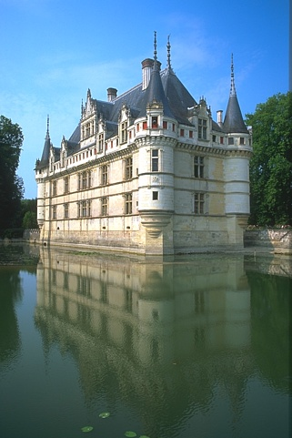
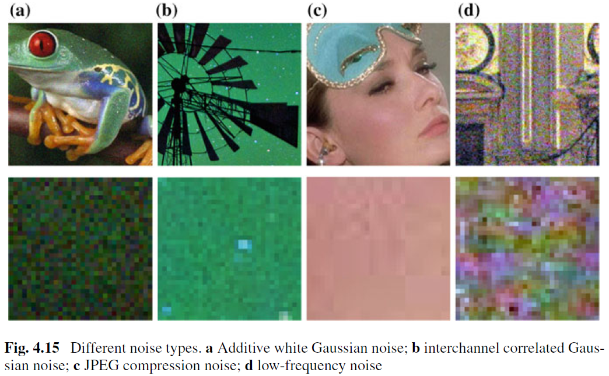

# [DnCNN](http://www4.comp.polyu.edu.hk/~cslzhang/paper/DnCNN.pdf)
# [Beyond a Gaussian Denoiser: Residual Learning of Deep CNN for Image Denoising](http://ieeexplore.ieee.org/document/7839189/)

 

**News:** [DRUNet](https://github.com/cszn/DPIR)

* State-of-the-art denoising performance

* Can be used for plug-and-play image restoration

*  

* [https://github.com/cszn/DPIR/blob/master/main_dpir_denoising.py](https://github.com/cszn/DPIR/blob/master/main_dpir_denoising.py)


# [PyTorch training and testing code](https://github.com/cszn/KAIR) - 18/12/2019


`I recommend to use the PyTorch code for training and testing. The model parameters of MatConvnet and PyTorch are same.`


- [main_train_dncnn.py](https://github.com/cszn/KAIR/blob/master/main_train_dncnn.py)

- [main_test_dncnn.py](https://github.com/cszn/KAIR/blob/master/main_test_dncnn.py)

- [main_test_dncnn3_deblocking.py](https://github.com/cszn/KAIR/blob/master/main_test_dncnn3_deblocking.py)


## Merge batch normalization (PyTorch)

```python

import torch
import torch.nn as nn


def merge_bn(model):
    ''' merge all 'Conv+BN' (or 'TConv+BN') into 'Conv' (or 'TConv')
    based on https://github.com/pytorch/pytorch/pull/901
    by Kai Zhang (cskaizhang@gmail.com) 
    https://github.com/cszn/DnCNN
    01/01/2019
    '''
    prev_m = None
    for k, m in list(model.named_children()):
        if (isinstance(m, nn.BatchNorm2d) or isinstance(m, nn.BatchNorm1d)) and (isinstance(prev_m, nn.Conv2d) or isinstance(prev_m, nn.Linear) or isinstance(prev_m, nn.ConvTranspose2d)):

            w = prev_m.weight.data

            if prev_m.bias is None:
                zeros = torch.Tensor(prev_m.out_channels).zero_().type(w.type())
                prev_m.bias = nn.Parameter(zeros)
            b = prev_m.bias.data

            invstd = m.running_var.clone().add_(m.eps).pow_(-0.5)
            if isinstance(prev_m, nn.ConvTranspose2d):
                w.mul_(invstd.view(1, w.size(1), 1, 1).expand_as(w))
            else:
                w.mul_(invstd.view(w.size(0), 1, 1, 1).expand_as(w))
            b.add_(-m.running_mean).mul_(invstd)
            if m.affine:
                if isinstance(prev_m, nn.ConvTranspose2d):
                    w.mul_(m.weight.data.view(1, w.size(1), 1, 1).expand_as(w))
                else:
                    w.mul_(m.weight.data.view(w.size(0), 1, 1, 1).expand_as(w))
                b.mul_(m.weight.data).add_(m.bias.data)

            del model._modules[k]
        prev_m = m
        merge_bn(m)


def tidy_sequential(model):
    for k, m in list(model.named_children()):
        if isinstance(m, nn.Sequential):
            if m.__len__() == 1:
                model._modules[k] = m.__getitem__(0)
        tidy_sequential(m)

```


# Training ([MatConvNet](http://www.vlfeat.org/matconvnet/))

- [Simplenn](http://www.vlfeat.org/matconvnet/wrappers/) version
    * [DnCNN_TrainingCodes_v1.1](https://github.com/cszn/DnCNN/tree/master/TrainingCodes/DnCNN_TrainingCodes_v1.1)

- [DagNN](http://www.vlfeat.org/matconvnet/wrappers/) version
    * [DnCNN_TrainingCodes_DagNN_v1.1](https://github.com/cszn/DnCNN/tree/master/TrainingCodes/DnCNN_TrainingCodes_DagNN_v1.1)

# Testing ([MatConvNet](http://www.vlfeat.org/matconvnet/) or Matlab)

- [demos]  `Demo_test_DnCNN-.m`.

- [models]  including the trained models for Gaussian denoising; a single model for Gaussian denoising, single image super-resolution (SISR) and deblocking.

- [testsets]  BSD68 and Set10 for Gaussian denoising evaluation; Set5, Set14, BSD100 and Urban100 datasets for SISR evaluation; Classic5 and LIVE1 for JPEG image deblocking evaluation.

# New FDnCNN Models 

I have trained new Flexible DnCNN (FDnCNN) models based on [FFDNet](https://github.com/cszn/FFDNet).

FDnCNN can handle noise level range of [0, 75] via a single model.

[Demo_FDnCNN_Gray.m](Demo_FDnCNN_Gray.m)

[Demo_FDnCNN_Gray_Clip.m](Demo_FDnCNN_Gray_Clip.m)

[Demo_FDnCNN_Color.m](Demo_FDnCNN_Color.m)

[Demo_FDnCNN_Color_Clip.m](Demo_FDnCNN_Color_Clip.m)


# Network Architecture and Design Rationale

- Network Architecture

   

- Batch normalization and residual learning are beneficial to Gaussian denoising (especially for a single noise level). The residual of a noisy image corrupted by additive white Gaussian noise (AWGN) follows a constant Gaussian distribution which stablizes batch normalization during training.

    * Histogram of noisy patches, clean patches, and residual (noise) patches from a batch of training. The noise level is 25, the patch size is 40x40, the batch size is 128.
    
   
     
    * Histogram of noisy patches, clean patches, and residual (noise) patches from another batch of training. The noise level is 25, the patch size is 40x40, the batch size is 128.
    
     
     
     * Noise-free image super-resolution does not have this property.
     
- Predicting the residual can be interpreted as performing one gradient descent inference step at starting point (i.e., noisy image).

    * The parameters in DnCNN are mainly representing the image priors (task-independent), thus it is possible to learn a single model for different tasks, such as image denoising, image super-resolution and JPEG image deblocking.
    
    * The left is the input image corrupted by different degradations, the right is the restored image by DnCNN-3.

    
   

# Results


## Gaussian Denoising

**The average PSNR(dB) results of different methods on the BSD68 dataset.**

|  Noise Level | BM3D | WNNM  | EPLL | MLP |  CSF |TNRD  | DnCNN | DnCNN-B | FDnCNN | DRUNet |
|:-------:|:-------:|:-------:|:-------:|:-------:|:-------:|:-------:|:-------:|:-------:|:-------:|:-------:|
| 15  |  31.07  |   31.37   | 31.21  |   -   |  31.24 |  31.42 | **31.73** | **31.61**  |**31.69**  | 31.91 |
| 25  |  28.57  |   28.83   | 28.68  | 28.96 |  28.74 |  28.92 | **29.23** | **29.16**  |**29.22**  | 29.48 |    
| 50  |  25.62  |   25.87   | 25.67  | 26.03 |    -   |  25.97 | **26.23** | **26.23**  | **26.27** | 26.59 |   


**Visual Results**

The left is the noisy image corrupted by AWGN, the middle is the denoised image by DnCNN, the right is the ground-truth.

  

  

  

## Gaussian Denoising, Single ImageSuper-Resolution and JPEG Image Deblocking via a Single (DnCNN-3) Model 

**Average PSNR(dB)/SSIM results of different methods for Gaussian denoising with noise level 15, 25 and 50 on BSD68 dataset, single image super-resolution with 
upscaling factors 2, 3 and 40 on Set5, Set14, BSD100 and Urban100 datasets, JPEG image deblocking with quality factors 10, 20, 30 and 40 on Classic5 and LIVE11 datasets.**

### Gaussian Denoising
|  Dataset    | Noise Level | BM3D | TNRD | DnCNN-3 |
|:---------:|:---------:|:---------:|:---------:|:---------:|
|       |  15  | 31.08 / 0.8722 | 31.42 / 0.8826 | 31.46 / 0.8826 |
| BSD68 |  25  | 28.57 / 0.8017 | 28.92 / 0.8157 | 29.02 / 0.8190 |
|       |  50  | 25.62 / 0.6869 | 25.97 / 0.7029 | 26.10 / 0.7076 |
### Single Image Super-Resolution
| Dataset | Upscaling Factor | TNRD | VDSR |DnCNN-3|
|:---------:|:---------:|:---------:|:---------:|:---------:|
|        | 2 | 36.86 / 0.9556 | 37.56 / 0.9591 | 37.58 / 0.9590 |
|Set5    | 3 | 33.18 / 0.9152 | 33.67 / 0.9220 | 33.75 / 0.9222 |
|        | 4 | 30.85 / 0.8732 | 31.35 / 0.8845 | 31.40 / 0.8845 |
|        | 2 | 32.51 / 0.9069 | 33.02 / 0.9128 | 33.03 / 0.9128 |
|Set14   | 3 | 29.43 / 0.8232 | 29.77 / 0.8318 | 29.81 / 0.8321 |
|        | 4 | 27.66 / 0.7563 | 27.99 / 0.7659 | 28.04 / 0.7672 |
|        | 2 | 31.40 / 0.8878 | 31.89 / 0.8961 | 31.90 / 0.8961 |
|BSD100  | 3 | 28.50 / 0.7881 | 28.82 / 0.7980 | 28.85 / 0.7981 |
|        | 4 | 27.00 / 0.7140 | 27.28 / 0.7256 | 27.29 / 0.7253 |
|        | 2 | 29.70 / 0.8994 | 30.76 / 0.9143 | 30.74 / 0.9139 |
|Urban100| 3 | 26.42 / 0.8076 | 27.13 / 0.8283 | 27.15 / 0.8276 |
|        | 4 | 24.61 / 0.7291 | 25.17 / 0.7528 | 25.20 / 0.7521 |
### JPEG Image Deblocking
|  Dataset | Quality Factor | AR-CNN | TNRD | DnCNN-3 |
|:---------:|:---------:|:---------:|:---------:|:---------:|
|Classic5| 10 | 29.03 / 0.7929 | 29.28 / 0.7992 | 29.40 / 0.8026 |
|        | 20 | 31.15 / 0.8517 | 31.47 / 0.8576 | 31.63 / 0.8610 |
|        | 30 | 32.51 / 0.8806 | 32.78 / 0.8837 | 32.91 / 0.8861 |
|        | 40 | 33.34 / 0.8953 |       -        | 33.77 / 0.9003 |
|  LIVE1 | 10 | 28.96 / 0.8076 | 29.15 / 0.8111 | 29.19 / 0.8123 |
|        | 20 | 31.29 / 0.8733 | 31.46 / 0.8769 | 31.59 / 0.8802 |
|        | 30 | 32.67 / 0.9043 | 32.84 / 0.9059 | 32.98 / 0.9090 |
|        | 40 | 33.63 / 0.9198 |       -        | 33.96 / 0.9247 |


# Requirements and Dependencies
- MATLAB R2015b
- [Cuda](https://developer.nvidia.com/cuda-toolkit-archive)-8.0 & [cuDNN](https://developer.nvidia.com/cudnn) v-5.1
- [MatConvNet](http://www.vlfeat.org/matconvnet/)

or just MATLAB R2015b to test the model.
https://github.com/cszn/DnCNN/blob/4a4b5b8bcac5a5ac23433874d4362329b25522ba/Demo_test_DnCNN.m#L64-L65

# Citation

```BibTex
@article{zhang2017beyond,
  title={Beyond a {Gaussian} denoiser: Residual learning of deep {CNN} for image denoising},
  author={Zhang, Kai and Zuo, Wangmeng and Chen, Yunjin and Meng, Deyu and Zhang, Lei},
  journal={IEEE Transactions on Image Processing},
  year={2017},
  volume={26}, 
  number={7}, 
  pages={3142-3155}, 
}
@article{zhang2020plug,
  title={Plug-and-Play Image Restoration with Deep Denoiser Prior},
  author={Zhang, Kai and Li, Yawei and Zuo, Wangmeng and Zhang, Lei and Van Gool, Luc and Timofte, Radu},
  journal={arXiv preprint},
  year={2020}
}
```

====================================================================

## [Convolutional Neural Networks for Image Denoising and Restoration](https://link.springer.com/chapter/10.1007/978-3-319-96029-6_4)

```
@Inbook{zuo2018convolutional,
author={Zuo, Wangmeng and Zhang, Kai and Zhang, Lei},
editor={Bertalm{\'i}o, Marcelo},
title={Convolutional Neural Networks for Image Denoising and Restoration},
bookTitle={Denoising of Photographic Images and Video: Fundamentals, Open Challenges and New Trends},
year={2018},
publisher={Springer International Publishing},
address={Cham},
pages={93--123},
isbn={978-3-319-96029-6},
doi={10.1007/978-3-319-96029-6_4},
url={https://doi.org/10.1007/978-3-319-96029-6_4}
}
```

### Challenges and Possible Solutions (from the above book chapter)

While the image denoising for AWGN removal has been well-studied, little work has been done on real image denoising.
The main difficulty arises from the fact that real noises are much more complex than AWGN and it is not an easy task to
thoroughly evaluate the performance of a denoiser. Fig. 4.15 shows four typical noise types in real world.
It can be seen that the characteristics of those noises are very different and a single noise level may be not enough to parameterize those noise types. In most cases, a denoiser can only work well under a certain noise model.
For example, a denoising model trained for AWGN removal is not effective for mixed Gaussian and Poisson noise removal.
This is intuitively reasonable because the CNN-based methods can be treated as general case of Eq. (4.3) and the important data fidelity term corresponds to the degradation process. In spite of this, the image denoising for AWGN removal is valuable due to the following reasons. First, it is an ideal test bed to evaluate the effectiveness of different CNN-based denoising methods.
Second, in the unrolled inference via variable splitting techniques, many image restoration problems can be addressed by sequentially solving a series of Gaussian denoising subproblems, which further broadens the application fields.

 

To improve the practicability of a CNN denoiser, perhaps the most straightforward way is to capture adequate amounts of real noisy-clean training pairs for training so that the real degradation space can be covered. This solution has advantage that there is no need to know the complex degradation process. However, deriving the corresponding clean image of a noisy one is not a trivial task due to the need of careful post-processing steps, such as spatial alignment and illumination correction. Alternatively, one can simulate the real degradation process to synthesize noisy images for a clean one. However, it is not easy to accurately model the complex degradation process. In particular, the noise model can be different across different cameras. Nevertheless, it is practically preferable to roughly model a certain noise type for training and then use the learned CNN model for type-specific denoising.

Besides the training data, the robust architecture and robust training also play vital roles for the success of a CNN denoiser.
For the robust architecture, designing a deep multiscale CNN which involves a coarse-to-fine procedure is a promising direction.
Such a network is expected to inherit the merits of multiscale:
(i) the noise level decreases at larger scales;
(ii) the ubiquitous low-frequency noise can be alleviated by multiscale procedure;
and (iii) downsampling the image before denoising can effectively enlarge the receptive filed.
For the robust training, the effectiveness of the denoiser trained with generative adversarial networks (GAN) for real image denoising still remains further investigation. The main idea of GAN-based denoising is to introduce an adversarial loss to improve the perceptual quality of denoised image. Besides, a distinctive advantage of GAN is that it can do unsupervised learning. More specifically,
the noisy image without ground truth can be used in the training. So far, we have provided several possible solutions to improve the practicability of a CNN denoiser. We should note that those solutions can be combined to further improve the performance.


