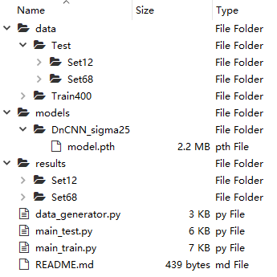

# DnCNN-PyTorch

This code is modified from [SaoYan](https://github.com/SaoYan/DnCNN-PyTorch).

## Dependence
```
pytorch 0.4.1
```


## Train
```
main_train.py
```

## Test

```
main_test.py
```

## Results

### Gaussian Denoising

The average PSNR(dB) results of different methods on the BSD68 dataset.

|  Noise Level | BM3D | DnCNN | DnCNN-PyTorch |
|:-------:|:-------:|:-------:|:-------:|
| 25  |  28.57 | 29.23 | 29.24  |


